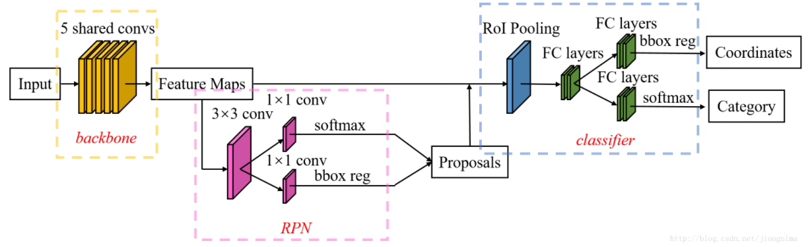
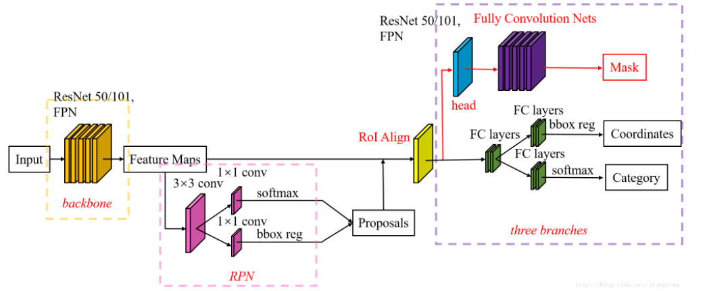
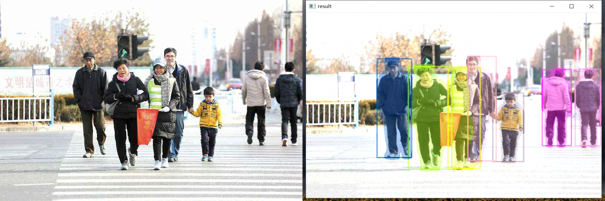
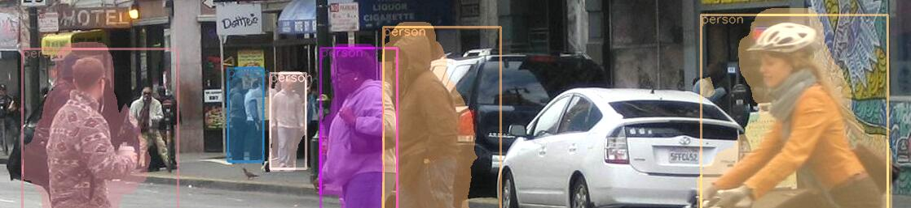
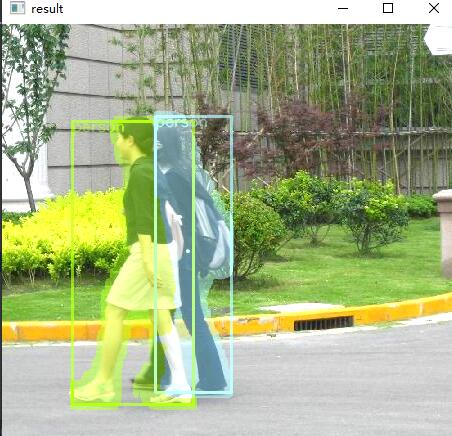

# Mask R-CNN

#### 大家好， 我是卓发林。一名中南民族大学生物医学工程学院的硕士研究生，目前的研究方向是基于深度学习目标检测算法与无线胶囊内窥镜的消化道疾病检测
#### 自我感觉硕士阶段的学习很愉快也很辛苦，就顺手更新一波自己的GitHub仓库吧。由于我本人的基础也不算差，目前本人从事的项目原因从而接触到最多的深度学习算法主要是目标检测类型，包括经典的Faster R-CNN(二阶段，anchor-base)、SSD和yolo系列(一阶段，anchor-base)等，后面将更新自己其余的目标检测算法代码。自己有空的时候也会接触别的领域算法（如语义分割、自然语言处理、OCR、道路检测等等）
#### 如果大家喜欢，可以留下大家的脚印。哈哈哈哈~~

### 该代码时我在参阅了pytorch教程，从而简单实现的Mask R-CNN网络。详细教程可参考[官网]哟~~(https://pytorch.org/tutorials/intermediate/torchvision_tutorial.html)
## 对比Faster R-CNN和Mask R-CNN 

***还请各位同行注意：***
  + R-CNN中的 **R** 是指 **RPN**，而非循环神经网络的 **R**，因此下文中统一使用了 R-CNN；
  + RPN 与循环神经网络是有很大区别的，但并不是不可通用，后面我将会使得二者结合，共同用于目标检测;
  + 别骂了，别骂了，已经在弄（新建文件夹，哈哈哈哈）了。

**Faster R-CNN结构**


如上图所示，Faster R-CNN的结构主要分为三大部分，第一部分是共享的卷积层-backbone，第二部分是候选区域生成网络-RPN，第三部分是对候选区域进行分类的网络-classifier。其中，RPN与classifier部分均对目标框有修正。classifier部分是继承的Fast R-CNN结构。

这个网络的影响和对我的记忆就极其深刻，主要有以下原因：
- Faster R-CNN是最典型的二阶段目标检测算法框架，其检测的精度可观；
- Faster R-CNN是我硕士期间做课题使用到的网络架构，很舒服。
- 这里是我硕士期间的部分代码链接[代码一：Faster R-CNN](https://github.com/zhuofalin/Pytorch_Faster_R-CNN), [代码二](https://github.com/zhuofalin/pytorch_zfl_all);其中Faster R-CNN当时是用keras书写，其[代码在此](https://github.com/zhuofalin/Keras-FasterRCNN))


在Mask R-CNN中的RoI Align之后有一个"head"部分，主要作用是将RoI Align的输出维度扩大，这样在预测Mask时会更加精确。在Mask Branch的训练环节，作者没有采用FCN式的SoftmaxLoss，反而是输出了K个Mask预测图(为每一个类都输出一张)，并采用average binary cross-entropy loss训练，当然在训练Mask branch的时候，输出的K个特征图中，也只是对应ground truth类别的那一个特征图对Mask loss有贡献。  
​&emsp;&emsp;RoI Align的主要创新点是，**不再进行取整操作**，使用**双线性插值**来更精确地找到每个块对应的特征。总的来说，RoI Align的作用主要就是剔除了RoI Pooling的取整操作，并且使得为每个RoI取得的特征能够更好地对齐原图上的RoI区域。

这个网络目前在我最近的实验中用于两处：
- OCR:使用Mask R-CNN作文字的检测；
- 分割:由于个人的专业出身和兴趣落脚点，在医学图像处理中检测病灶与肿瘤位置等时会用到Mask R-CNN；
- 医学图像处理 ***YYDS*** [不服来辩，反正你说的我不同意](https://image.baidu.com/search/detail?ct=503316480&z=0&ipn=d&word=%E4%B8%8D%E6%9C%8D%E6%9D%A5%E8%BE%A9&step_word=&hs=0&pn=19&spn=0&di=55780&pi=0&rn=1&tn=baiduimagedetail&is=0%2C0&istype=0&ie=utf-8&oe=utf-8&in=&cl=2&lm=-1&st=undefined&cs=1739123142%2C2982147058&os=548898282%2C2352568360&simid=1739123142%2C2982147058&adpicid=0&lpn=0&ln=1789&fr=&fmq=1639296970881_R&fm=&ic=undefined&s=undefined&hd=undefined&latest=undefined&copyright=undefined&se=&sme=&tab=0&width=undefined&height=undefined&face=undefined&ist=&jit=&cg=&bdtype=15&oriquery=&objurl=https%3A%2F%2Fgimg2.baidu.com%2Fimage_search%2Fsrc%3Dhttp%3A%2F%2Fnimg.ws.126.net%2F%3Furl%3Dhttp%3A%2F%2Fdingyue.ws.126.net%2F2021%2F0209%2Fe687a9dbj00qo9o0g002gc000j800phm.jpg%26thumbnail%3D650x2147483647%26quality%3D80%26type%3Djpg%26refer%3Dhttp%3A%2F%2Fnimg.ws.126.net%26app%3D2002%26size%3Df9999%2C10000%26q%3Da80%26n%3D0%26g%3D0n%26fmt%3Djpeg%3Fsec%3D1641888988%26t%3Da854d21699cd26389e490c9bef0adf5b&fromurl=ippr_z2C%24qAzdH3FAzdH3F1y_z%26e3B8mn_z%26e3Bv54AzdH3Fw6ptvsjAzdH3FGdEbSLJmac9mImUX_z%26e3Bip4s&gsm=13&rpstart=0&rpnum=0&islist=&querylist=&nojc=undefined&dyTabStr=MCwzLDYsMiw0LDEsNSw3LDgsOQ%3D%3D)


### 1. 基本环境需要

本人用Win10跑的代码，显卡RTX3060 6G，因为采用的时预训练的backbone(ResNet50 + FPN)，且数据集较小，所以对GPU没有过高的要求。

**没有提示安装的，按需要直接pip安装就可以了!!!!**

```
CUDA11
pip install python == 3.7.11
pip install pytorch == 1.8.0
torchvision == 0.9.0
```

### 2. pycocotools的安装

在整个过程中你要安装 pycocotools，主要用到其中的IOU计算的库来评价模型的性能。但是这个安装有点复杂，在安装过程中遇到了很多问题，但是通过下面的方法得到了解决。
1. 到这个[地址](https://pypi.tuna.tsinghua.edu.cn/simple/pycocotools-windows/)根据自己的电脑系统和python版本，找到与之相应的版本，然后把pycocotools对应版本的whl文件直接下载到本地。

2. 切换到相应的环境，直接 pip install 然后把下载的文件拖进命令行，直接回车即可!!!!!!


## 项目结构与意义
+ 1：[dataset](dataset)是数据存放目录
    - 一般是程序运行中产生的数据片段
    - 该代码目前暂不涉及
    - 需要请自行增删即可
+ 2：[illustration](illustration) 是自己在写readme需要使用到的图片,于本项目没啥用。
+ 3：[img](img) 是该程序的数据存放目录。
  - 该代码目前暂不涉及
  - 需要请自行增删即可
+ 4：[logs](logs)是该程序的log模块。
+ 5: [nets](nets)是该程序的核心网络模块。
+ 6: [runs](runs)是该程序的保存tensorboard的runs模块。
+ 7：[utils](utils):一些辅助函数，计算图像训练集的像素均值等。
+ 8：[weights](weights):保存权重文件目录，代码中已经书写。
+ 9：[其它](train.py) :顾名思义的功能：
  - [训练](train.py) [测试](test.py) [预测](predict.py) 
  - [数据处理](my_dataset.py)
  - [不管它1](main.py) [不管它2](ops.py):
  - [之前构造项目时手贱创建的]


## 4. 运行

```python
# 会保留最后一个Epoch的权重
 python training.py
# 指定GPU训练模型 
 CUDA_VISIBLE_DIVICES= 这里写可用的GUP的序号(例如: 0,1,2,3) python tv-training-code.py
# 训练结束后，修改 predict.py 里面的权重路径即可进行预测
 python predict.py
```

##### 预测结果:

)



### 补充

**示例数据集：**  
**[PennFudanPed](https://www.cis.upenn.edu/~jshi/ped_html/)**  下载并解压，然后把PennFudanPed文件夹直接放在与predict.py同级目录即可。

**权重下载：**  
**[MaskRCNN_9.pth](链接: https://pan.baidu.com/s/1n97fyrqYAOIS7dIB_NXgHw 提取码: dk8s )**

___

### 博客推荐

**1. [实例分割模型Mask-RCNN网络原理与架构详解](https://blog.csdn.net/qq_27825451/article/details/89677068)**

**2. [实例分割模型Mask R-CNN详解：从R-CNN，Fast R-CNN，Faster R-CNN再到Mask R-CNN](https://blog.csdn.net/jiongnima/article/details/79094159)**

___
## 酱紫啦
感谢遇见，一切安好
 [下次再见](https://github.com/zhuofalin)